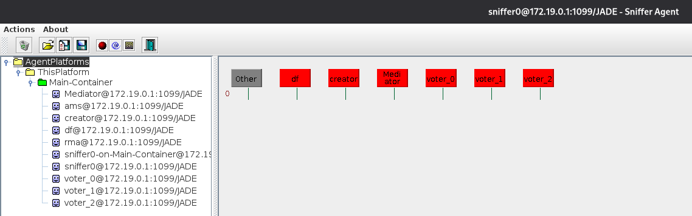
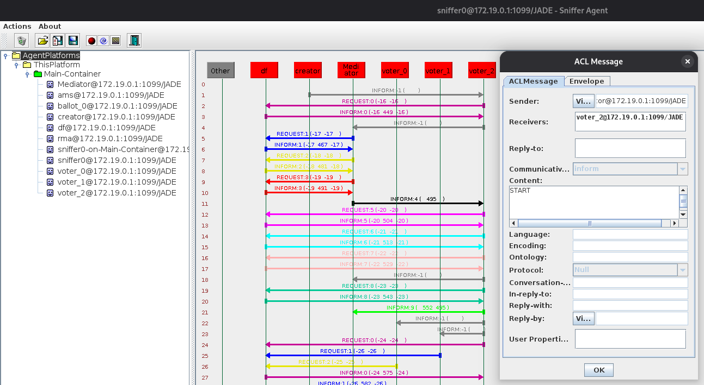
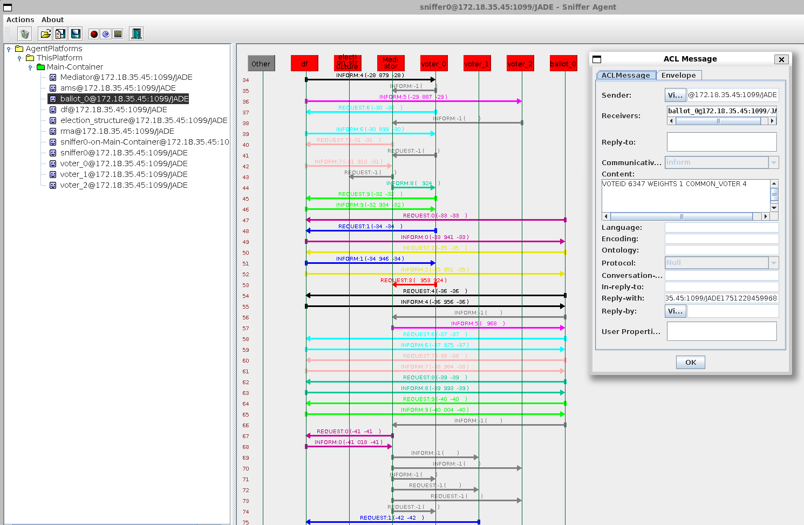
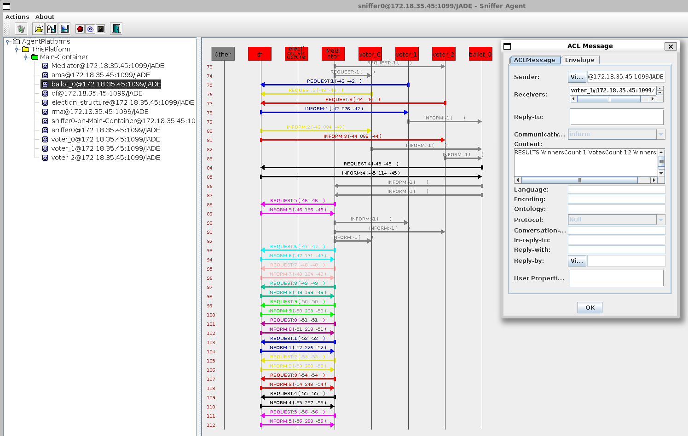

# Estrutura de Eleição

## Autores

| **Identificação** | **Nome** | **Formação** |
| :-: | :-: | :-: |
|  | André Corrêa da Silva | Graduando em Engenharia de Software (UnB) |
|  | Gabriel Mariano da Silva | Graduando em Engenharia de Software (UnB) |

*Tabela 1: Identificação dos Autores*

## Métricas do *Building Block*

[](https://sonarcloud.io/summary/new_code?id=tcc-sma-andre-gabriel_election-structure)
[](https://sonarcloud.io/summary/new_code?id=tcc-sma-andre-gabriel_election-structure)
[](https://sonarcloud.io/summary/new_code?id=tcc-sma-andre-gabriel_election-structure)

[](https://sonarcloud.io/summary/new_code?id=tcc-sma-andre-gabriel_election-structure)
[](https://sonarcloud.io/summary/new_code?id=tcc-sma-andre-gabriel_election-structure)
[](https://sonarcloud.io/summary/new_code?id=tcc-sma-andre-gabriel_election-structure)

[](https://sonarcloud.io/summary/new_code?id=tcc-sma-andre-gabriel_election-structure)

## Descrição

O *building block* contido neste repositório tem por objetivo o desenvolvimento de um sistema de eleições, o qual descreve um processo da democracia, esse que visa a escolha de um representante dentre os candidatos possíveis, sendo escolhido aquele que receber a maior quantidade de votos.

Nele, é proposto o desenvolvimento de um sistema onde um agente solicita ao mediador a criação de uma eleição, o qual retorna ao solicitante um código identificador para a eleição criada. O agente solicitante então compartilha o código identificador recebido para os outros agentes votantes, os quais podem então se registrar na eleição e, caso desejado, se candidatar e apresentar suas propostas.

Atingido então o quórum mínimo de candidatos e participantes cadastrados na votação (respectivamente, 1 candidato e 2 votantes, ao menos), o mediador se responsabiliza pela solicitação da instanciação da urna (representada por um agente em específico) para a respectiva eleição. Destaca-se a possibilidade de configuração de pesos aos votos disponibilizados pelos agentes votantes (representando agentes com pesos diferentes na decisão a ser tomada).

Logo, dá-se então o início do processo eleitoral (informado pelo mediador aos participantes da votação). A mesma se estende por um período definido por um *timeout* iniciado pela urna. Após a coleta dos votos de todos os participantes ou o final do tempo disponibilizado, a urna inicia o processo de contabilização dos resultados da eleição, considerando todos os votos recebidos com seus respectivos pesos e candidatos aos quais estes se direcionam (ou, caso não se direcione a nenhum candidato registrado, há a contabilização do voto como sendo nulo).

Após a contabilização do resultado pela urna, a mesma retorna ao agente mediador o resultado da eleição com todos os agentes vencedores (podendo haver empates) e um *log* contendo um balanço com a relação da quantidade de votos (já com os pesos aplicados) recebidos por cada candidato. O agente mediador, tendo recebido os resultados da eleição, informa os mesmos a todos os agentes votantes participantes da eleição.

Por fim, o agente mediador se responsabiliza pela deleção de todas as informações relativas à votação realizada, encerrando assim o processo decisório.

## Projeto em Execução

Abaixo, é possível ver o uso do sniffer da plataforma JADE sobre a comunicação realizada entre os agentes após a execução da aplicação anteriormente descrita.



*Figura 1: Visualização dos Agentes pelo Sniffer*

Na *Figura 1*, é possível ver ver os principais agentes instanciados pelo agente *creator* ao início da execução do *building block*, representando os papéis de mediador da eleição e seus votantes.

Abaixo, na *Figura 2*, pode ser vista a mensagem de *start* enviada pelo agente *creator* a um agente votante escolhido randomicamente. Esta mensagem dá início a toda a lógica de solicitação e realização da eleição.



*Figura 2: Mensagem de Início da Execução da Eleição*

Adiante, na *Figura 3*, é apresentada a mensagem com as informações necessárias para a correta configuração da urna para a realização da eleição (i.e., o código da votação e os possíveis pesos existentes na votação).



*Figura 3: Mensagem com as Informações Necessárias para a Configuração da Urna*

Por fim, na *Figura 4* é possível ver a mensagem contendo os resultados da eleição realizada enviada pelo agente mediator a todos os agentes participantes da votação.



*Figura 4: Mensagem com os Resultados da Eleição Realizada*

## Requisitos Técnicos

1. **Criação da Eleição:** mediante solicitação de um agente votante, o agente mediador deve ser capaz de criar uma eleição com um código de identificação para tal.
2. **Compartilhamento de Votação:** recebido o código de identificação da eleição, o agente votante que solicitou a eleição deve ser capaz de compartilhar o mesmo com os demais agentes votantes, os quais devem todos se registrar no DF com o código recebido, afim de serem identificados como participantes da votação.
3. **Candidatura:** uma vez recebido o código de identificação da eleição, o agente votante deve ser capaz de, caso desejado, se candidatar à eleição, enviando uma proposta de candidatura ao mediador.
4. **Preparação da Urna:** recebidos os retornos dos agentes votantes e dos candidatos, o mediador deve ser capaz de solicitar ao agente *creator* a instanciação de uma urna - representada por um agente específico - com todas as informações necessárias para a votação.
5. **Iniciação da Eleição:** instanciada a urna e definidas as principais informações necessárias para a votação na mesma, esta deve ser capaz de informar seu estado de prontidão ao agente mediador que, por sua vez, deve ser capaz de informar o início da eleição aos agentes participantes da mesma.
6. **Fornecimento dos Votos:** os agentes votantes registrados no DF como participantes da eleição devem ser capazes de fornecerem seus votos para os candidatos registrados na urna. Caso o voto registrado não se encaixe em nenhuma das opções, ele deve ser considerado como voto nulo.
7. **Votação com Pesos:** o *building block* desenvolvido deve conceber a possibilidade de atribuição de pesos aos votos dos agentes de acordo com categorias pré-estabelecidas em cada votação.
8. **Finalização da Coleta dos Votos por *Timeout* ou Totalidade dos Votos Recebidos:** uma vez iniciada a votação, a urna deve iniciar um *timeout* para o recebimento dos votos. Caso a urna receba todos os votos antes da finalização do *timeout*, ela deve ser capaz de dar prosseguimento à contabilização dos resultados. Por outro lado, finalizado o *timeout*, a urna não deve contabilizar nenhum possível voto recebido após a finalização, ainda sendo capaz de realizar a contabilização dos votos.
9. **Contabilização do Resultado:** finalizado o período de votação (por integralidade de participação do quórum de votantes ou por *timeout*), a urna deve ser capaz de contabilizar os votos recebidos, levando em consideração os candidatos aos quais eles se dirigem e o peso que os mesmos possuem de acordo com o "tipo" de agente votante.
10. **Informação do Resultado:** Uma vez contabilizado o resultado da eleição pela urna, esta deve ser capaz de informar ao agente mediador da eleição os vencedores da mesma (podendo ser mais de um candidato, em caso de empate). Além disso, esta deve ser capaz de enviar também um *log* da eleição, isto é, um balanço com a relação da quantidade de votos (já com os pesos aplicados) recebidos por cada candidato. O agente mediador, tendo recebido os resultados da eleição, deve ser capaz de compartilhar com todos os agentes participantes da eleição o resultado da mesma.
11. **Deleção das Informações da Votação:** Finalizado todo o processo eleitoral (considerando todas as etapas que o compõem), o agente mediador deve se responsabilizar pela deleção de todos os dados relativos ao processo, sejam aqueles internos a si ou aqueles registrados no DF (como, por exemplo, o código da eleição registrado para cada participante da mesma e as informações relativas aos candidatos da mesma).

## Requisitos para Execução

Para a efetiva execução do *building block* disposto no repositório, se faz necessária a instalação e configuração do *software* *Maven* em sua máquina. Para tal, basta seguir as instruções de instalação dispostas na [**documentação do *Maven***](https://maven.apache.org/install.html). Para o desenvolvimento do *building block*, foi utilizado o *Maven* na versão **3.8.7**. Além disso, todas as instruções de execução consideram o uso de sistemas operacionais baseados em *Linux*.

## Como Executar?

Para a execução do *building block*, é possível utilizar-se do *Makefile* adicionado ao repositório ao seguir os seguintes passos:

- Primeiramente, clone o repositório em sua máquina:

```bash
git clone https://github.com/SMA-building-blocks/election-structure.git
```

- Em seguida, vá para a pasta do repositório:

```bash
cd election-structure
```

- Para realizar a *build* do projeto e executá-lo em seguida, execute o seguinte comando:

```bash
make build-and-run
```

> 🚨 **IMPORTANTE:** Ao executar o projeto, primeiro será realizada a criação de todos os agentes participantes. Logo após, para a efetiva realização do propósito desejado pelo *building block*, é necessário pressionar **ENTER** no terminal para a continuidade da execução do código. Esta decisão foi tomada em prol de uma facilitação do uso do *sniffer* para a visualização da comunicação entre os agentes participantes.

- É possível realizar apenas a *build* do projeto com o seguinte comando:

```bash
make build
```

- Similarmente, é possível rodar o projeto após a geração de sua build com o seguinte comando:

```bash
make run
```

- É possível alterar a quantidade de agentes participantes ao passar a variável **QUORUM** seguida do número desejado, como pode ser visto abaixo (onde N representa o número desejado de agentes):

```bash
make build-and-run QUORUM=N
```

- Por fim, para apagar os arquivos derivados da *build* do projeto, execute o seguinte comando:

```bash
make clean
```

- Para ter acesso a uma série de informações úteis para a execução do building block, basta executar o seguinte comando:

```bash
make help
```
